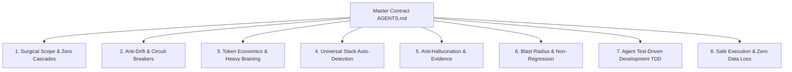

# 🧠 Agent Constitution

<div align="center">

[](https://opensource.org/licenses/MIT)
[](./CONTRIBUTING.md)
[](./.github/workflows/ci.yml)
[](#-universal-model--stack-agnostic)
[](#-universal-tool-adapters)

**The Universal Behavioral Contract & Context Engine that turns any AI coding agent into a disciplined senior engineer — eliminating cascading regressions, hallucinated tangents, and token-burning loops.**

[Quick Start](#-quick-start) • [The Core Problem](#-the-reality-of-ai-coding-today) • [Surgical Scope](#1-surgical-editing--the-anti-cascade-law) • [The 8 Pillars](#-the-constitutional-pillars) • [Tool Compatibility](#-universal-tool-adapters) • [Acknowledgements](#-acknowledgements--credits)

</div>

---

## ⚡ The Reality of AI Coding Today

Left to their default behaviors, AI coding agents across all major models exhibit predictable, frustrating failure modes:

| ❌ Default Agent Behavior (Chaos) | ✅ With Agent Constitution (Order) |
|---|---|
| **Cascading Breakages (1 fix breaks 3 things)**: Fixes a small bug, but "helpfully" refactors adjacent code, breaking untested callers. | **Surgical Scope & Quarantine**: Forbidden from touching adjacent code. Minimal Viable Diff (MVD) only. |
| **Context Vomit & Agent Drift**: Wanders into lengthy tutorial prose, guesses irrelevant causes, or loops on errors. | **Anti-Drift & 3-Strike Circuit Breaker**: Mandates hard stop after 3 failed attempts; re-anchors directly on original prompt. |
| **Token Waste & Echoing**: Burns 100k tokens dumping 500 lines of unchanged code back into the chat. | **Heavy Braining, Min Tokens**: Maximum cognitive reasoning delivered in compact, high-density diffs. Zero fluff. |
| **Single-Language Bias**: Treats every repo like a toy Python or JS script, ignoring project idioms. | **Universal Stack Auto-Detection**: Fingerprints any stack (Rust, Go, C#, C++, Java, PHP, Ruby, Swift, Elixir, IaC). |
| **Session Amnesia**: Every new chat starts from zero, re-discovering the codebase from scratch. | **Persistent Memory (`CONTEXT.md` / `TASKS.md`)**: Maintains lightweight project state across sessions and models. |
| **Sycophantic "Yes-Man"**: Nods along with bad architecture and skims only the single line you pointed at. | **Anti-Sycophancy & Adversarial Security**: Conducts rigorous OWASP and edge-case audits without flattery. |
| **Hallucinates APIs & Dependencies**: Guesses libraries, files, and signatures that don't exist. | **Evidence-First Verification**: Forbidden from asserting facts without inspecting code and raw terminal proof. |
| **Catastrophic Commands**: Drops tables, runs `git reset --hard` on uncommitted files, or leaks secrets. | **Zero-Data-Loss Guardrails**: Immediate stop-and-verify lockout on destructive commands. |

---

## 🚀 Quick Start

### Option 1: One-Line Installer (Zero Friction)

Run inside your project's root directory:

**Linux / macOS:**
```bash
curl -fsSL https://raw.githubusercontent.com/OWNER/agent-constitution/main/scripts/install.sh | bash
```

**Windows (PowerShell):**
```powershell
irm https://raw.githubusercontent.com/OWNER/agent-constitution/main/scripts/install.ps1 | iex
```

### Option 2: Manual Drop-In

1. Copy [`AGENTS.md`](./AGENTS.md), [`docs/`](./docs/), and [`templates/`](./templates/) into your project root.
2. Initialize memory files:
   ```bash
   cp templates/CONTEXT.md CONTEXT.md
   cp templates/TASKS.md TASKS.md
   ```
3. Copy the adapter matching your tool (e.g., `CLAUDE.md`, `.cursorrules`, `.windsurfrules`, `.clinerules`, or `.github/copilot-instructions.md`).
4. Point your agent at `AGENTS.md` and enjoy disciplined engineering!

---

## 🏛️ The Constitutional Pillars



### 1. Surgical Editing & The Anti-Cascade Law
*(Full detail: [`docs/surgical-editing-and-scope-containment.md`](./docs/surgical-editing-and-scope-containment.md))*
- **The #1 Problem**: AI agents love doing "drive-by refactoring" — fixing a bug while "helpfully" cleaning up neighboring code or changing shared signatures. This causes 1 fix to spawn 3 new bugs.
- **The Constitutional Rule**: The agent is bound to the **Minimal Viable Diff (MVD)**. It is forbidden from touching, refactoring, or reformatting adjacent code. If it discovers another issue nearby, it must quarantine it in `TASKS.md` — never touch it autonomously.

### 2. Agent Drift Prevention & 3-Strike Circuit Breakers
*(Full detail: [`docs/drift-prevention-and-circuit-breakers.md`](./docs/drift-prevention-and-circuit-breakers.md))*
- Stops agents from getting lost in conversational rabbit holes, dumping massive error logs, or thrashing code in infinite loops.
- **3-Strike Rule**: If an edit fails 3 consecutive times, the agent must **HARD STOP**, summarize the blocker, and ask for guidance.

### 3. Token Economics & Heavy Braining (Max Output, Min Tokens)
*(Full detail: [`docs/token-economy-and-max-output.md`](./docs/token-economy-and-max-output.md))*
- Maximum cognitive depth (Heavy Braining) paired with extreme token discipline.
- **Zero Fluff**: No conversational pleasantries.
- **No Echoing**: Never dump 400 lines of unchanged code back to the user; output targeted diffs only.
- **Line-Bounded Tool Calls**: Inspect targeted line ranges instead of loading massive files into context.

### 4. Universal Stack Auto-Detection
*(Full detail: [`docs/universal-stack-detection.md`](./docs/universal-stack-detection.md))*
- Stack-agnostic engineering that works for **any language**: Rust, Go, Python, TypeScript/JS, C#, C++, Java, Kotlin, PHP, Ruby, Elixir, Swift, Dart, Shell, SQL, Terraform, etc.
- Dynamically discovers and respects local repository manifests and linters (`.editorconfig`, `ruff.toml`, `.golangci.yml`, `phpcs.xml`, `clippy`, etc.).

### 5. Anti-Hallucination & Epistemic Modesty
*(Full detail: [`docs/anti-hallucination-evidence.md`](./docs/anti-hallucination-evidence.md))*
- Never claim an API, file, or function behaves in a certain way without inspecting it directly in the current session. Cite exact file paths and line numbers.

### 6. Blast Radius & Non-Regression Policy
*(Full detail: [`docs/non-regression-policy.md`](./docs/non-regression-policy.md))*
- Search all callers, protect the Do-Not-Touch list, and verify tests pass with exit code 0 before concluding.

### 7. Test-Driven Development (TDD) for Agents
*(Full detail: [`docs/tdd-and-verification.md`](./docs/tdd-and-verification.md))*
- Red-Green-Refactor agent cycle. Agents with automated test feedback loops produce 80% fewer hallucinations.

### 8. Safe Execution & Zero Data Loss
*(Full detail: [`docs/safe-execution-guardrails.md`](./docs/safe-execution-guardrails.md))*
- Hard lockout on destructive commands (`DROP TABLE`, `rm -rf /`, `git reset --hard` on dirty trees, `git push --force`).

---

## 🌐 Universal Model & Stack Agnostic

Agent Constitution is engineered from the ground up to be **model-neutral**:
- Works with **Frontier LLMs**: Claude 3.5 / 3.7 Sonnet, OpenAI GPT-4o / o1 / o3-mini, Google Gemini 2.0 Flash / Pro.
- Works with **Reasoning & Open-Source LLMs**: DeepSeek-R1 / V3, Qwen 2.5 Coder, Llama 3.3, Mistral Large.

It relies on universal structural constraints (checklists, negative constraints, machine-readable manifests) that any modern instruction-tuned model respects.

---

## 🗂️ Complete File Directory

| Document / Asset | Purpose |
|---|---|
| [`AGENTS.md`](./AGENTS.md) | **The Master Behavioral Contract**. Read first on every session. |
| [`CLAUDE.md`](./CLAUDE.md) | Universal adapter for Claude Code. |
| [`.cursorrules`](./.cursorrules) & [`.cursor/rules/`](./.cursor/rules/agent-constitution.mdc) | Universal adapters for Cursor (legacy & MDC formats). |
| [`.windsurfrules`](./.windsurfrules) | Universal adapter for Windsurf / Cascade. |
| [`.clinerules`](./.clinerules) | Universal adapter for Cline / Roo Code. |
| [`.github/copilot-instructions.md`](./.github/copilot-instructions.md) | Universal adapter for GitHub Copilot. |
| [`GEMINI.md`](./GEMINI.md) | Universal adapter for Gemini Code Assist / Google Antigravity. |
| [`docs/surgical-editing-and-scope-containment.md`](./docs/surgical-editing-and-scope-containment.md) | Eliminating cascading regressions and unrequested drive-by edits. |
| [`docs/drift-prevention-and-circuit-breakers.md`](./docs/drift-prevention-and-circuit-breakers.md) | Stopping agent tangents, context vomiting, and 3-strike loops. |
| [`docs/token-economy-and-max-output.md`](./docs/token-economy-and-max-output.md) | Heavy braining with minimal token consumption; zero echo rules. |
| [`docs/universal-stack-detection.md`](./docs/universal-stack-detection.md) | Dynamic auto-detection for ANY programming language or runtime. |
| [`docs/context-memory.md`](./docs/context-memory.md) | Token economics, compaction, and cross-session memory protocol. |
| [`docs/anti-hallucination-evidence.md`](./docs/anti-hallucination-evidence.md) | Epistemic grounding, citations, and evidence-first rules. |
| [`docs/task-management.md`](./docs/task-management.md) | PEV (Plan-Execute-Verify) engine and ambiguity scoring. |
| [`docs/non-regression-policy.md`](./docs/non-regression-policy.md) | Blast radius calculation and tripwire testing. |
| [`docs/security-and-depth.md`](./docs/security-and-depth.md) | Anti-sycophancy mandate and OWASP security review surface. |
| [`docs/safe-execution-guardrails.md`](./docs/safe-execution-guardrails.md) | Zero-data-loss and destructive command blacklist. |
| [`docs/tdd-and-verification.md`](./docs/tdd-and-verification.md) | Red-Green-Refactor and bug reproduction protocols. |
| [`docs/subagent-orchestration.md`](./docs/subagent-orchestration.md) | Architect vs. Builder vs. Auditor multi-agent coordination. |
| [`docs/architecture-standards.md`](./docs/architecture-standards.md) | Clean Architecture, modular layouts, and file sizing limits. |
| [`docs/coding-standards.md`](./docs/coding-standards.md) | Defensive programming, zero placeholders, and error ergonomics. |
| [`docs/deployment-guide.md`](./docs/deployment-guide.md) | Twelve-Factor apps, zero-downtime migrations, and health probes. |
| [`docs/languages/`](./docs/languages/) | Deep stack conventions: Python, TypeScript/Node, Go, Rust, React/Web, Java/Kotlin. |
| [`templates/`](./templates/) | Drop-in templates: [`CONTEXT.md`](./templates/CONTEXT.md), [`TASKS.md`](./templates/TASKS.md), [`ADR.md`](./templates/ADR.md), [`INCIDENT_POSTMORTEM.md`](./templates/INCIDENT_POSTMORTEM.md), [`SECURITY_CHECKLIST.md`](./templates/SECURITY_CHECKLIST.md). |
| [`scripts/`](./scripts/) | Automation: [`install.sh`](./scripts/install.sh), [`install.ps1`](./scripts/install.ps1), [`validate-constitution.sh`](./scripts/validate-constitution.sh). |

---

## 🌟 Acknowledgements & Credits

Agent Constitution synthesizes and operationalizes the ground-breaking work of pioneers across AI research and software engineering:

- **Anthropic**: Constitutional AI philosophy, Claude system prompt architecture, and epistemic tool-use guidelines.
- **Google DeepMind**: Advanced agentic coding standards, tool grounding, and context window economics.
- **Aider ([paulgauthier/aider](https://github.com/paulgauthier/aider))**: Git-backed agent workflows, repo maps, and the Architect/Editor model.
- **Cursor ([cursor.com](https://cursor.com)) & Cursor Rules Community**: Pioneer of localized context governance via `.cursorrules` and `.cursor/rules/*.mdc`.
- **Superpowers & Agentic Workflow Community**: TDD agent execution loops, systematic debugging disciplines, and verification before completion.
- **Claude-Mem & MemPalace**: Persistent cross-session knowledge bases and project memory distillation.
- **GSD (Get-Stuff-Done) Engine**: Socratic scoping, ambiguity scoring matrices, and wave parallelization.
- **OpenHands & SWE-bench**: Empirical taxonomies of agent failure modes and benchmark evaluation.
- **OWASP Foundation**: Application Security Verification Standard (ASVS) and Top 10 vulnerabilities.
- **Kent Beck & Adam Wiggins**: Test-Driven Development (TDD) and The Twelve-Factor App.

For a full breakdown of references and citations, see [`ACKNOWLEDGEMENTS.md`](./ACKNOWLEDGEMENTS.md).

---

## 🤝 Contributing

We welcome additions of new stack standards, IDE adapters, and real-world failure post-mortems! See [`CONTRIBUTING.md`](./CONTRIBUTING.md).

---

## 📄 License

[MIT License](./LICENSE) — Free to use, fork, and adapt for personal and enterprise projects.

---

<div align="center">
⭐ <b>If Agent Constitution saved your codebase from an agent-induced 2 AM incident, star this repository!</b>
</div>
