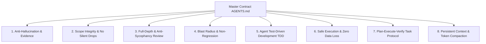

# 🧠 Agent Constitution

<div align="center">

[](https://opensource.org/licenses/MIT)
[](./CONTRIBUTING.md)
[](./.github/workflows/ci.yml)
[](https://cursor.com)
[](https://claude.ai)
[](https://codeium.com/windsurf)
[](https://github.com/cline/cline)
[](https://aider.chat)

**The Universal Behavioral Contract & Context Engine that turns any AI coding agent into a disciplined senior engineer — instead of a token-burning, hallucinating, corner-cutting one.**

[Quick Start](#-quick-start) • [The Core Problem](#-the-problem) • [The 8 Pillars](#-the-8-constitutional-pillars) • [Tool Compatibility](#-universal-tool-adapters) • [Acknowledgements](#-acknowledgements--credits)

</div>

---

## ⚡ The Reality of AI Coding Today

Left to their default behaviors, even frontier models (Claude 3.7 Sonnet, GPT-4o, Gemini 2.0 Flash) exhibit predictable failure modes:

| ❌ Default Agent Behavior (Chaos) | ✅ With Agent Constitution (Order) |
|---|---|
| **Hallucinates APIs & Paths**: Guesses libraries, files, and method signatures that don't exist. | **Evidence-First Verification**: Forbidden from asserting facts without inspecting code and raw terminal proof. |
| **Cherry-Picks Prompts**: Does the 60% that's easy, silently drops the rest, and fills gaps with guesswork. | **Scope Integrity**: Contractually bound to address 100% of requirements or explicitly explain trade-offs. |
| **Silent Collateral Damage**: Fixes bug #1 while quietly breaking features #2 and #3 in shared files. | **Blast Radius Mapping & Non-Regression**: Traces callers and runs regression test tripwires before touching code. |
| **Session Amnesia**: Every new chat starts from zero, burning 50k tokens re-discovering the codebase. | **Persistent Memory (`CONTEXT.md` / `TASKS.md`)**: Maintains lightweight, high-density project state across sessions. |
| **Sycophantic "Yes-Man"**: Nods along with bad architecture and skims only the single line you pointed at. | **Anti-Sycophancy & Adversarial Security**: Conducts rigorous OWASP and edge-case audits without flattery. |
| **Code Churn & Guess-Debugging**: Randomly edits files hoping tests turn green. | **Test-Driven Development (TDD)**: Reproduces bugs with automated tests before touching implementation code. |
| **Catastrophic Commands**: Drops tables, runs `git reset --hard` on uncommitted files, or leaks secrets. | **Zero-Data-Loss Guardrails**: Immediate stop-and-verify lockout on destructive commands. |

---

## 🚀 Quick Start

### Option 1: One-Line Installer (Recommended)

Run inside your project's root directory:

**Linux / macOS:**
```bash
curl -fsSL https://raw.githubusercontent.com/OWNER/agent-constitution/main/scripts/install.sh | bash
```

**Windows (PowerShell):**
```powershell
irm https://raw.githubusercontent.com/OWNER/agent-constitution/main/scripts/install.ps1 | iex
```

### Option 2: Manual Drop-In (Zero Dependencies)

1. Copy [`AGENTS.md`](./AGENTS.md), [`docs/`](./docs/), and [`templates/`](./templates/) into your project root.
2. Initialize memory files:
   ```bash
   cp templates/CONTEXT.md CONTEXT.md
   cp templates/TASKS.md TASKS.md
   ```
3. Copy the adapter matching your tool (e.g., `CLAUDE.md`, `.cursorrules`, `.windsurfrules`, `.clinerules`, or `.github/copilot-instructions.md`).
4. Point your agent at `AGENTS.md` and start working!

---

## 🏛️ The 8 Constitutional Pillars

Every AI agent governed by this repository adheres to 8 battle-tested engineering laws:



1. **Anti-Hallucination & Epistemic Modesty** ([`docs/anti-hallucination-evidence.md`](./docs/anti-hallucination-evidence.md))  
   Never assert how an API, function, or file behaves without inspecting it directly. Cite exact file paths and line numbers.

2. **Scope Integrity** ([`docs/task-management.md`](./docs/task-management.md))  
   No cherry-picking. Address every requested requirement or state why. Zero drive-by refactoring of unrelated code.

3. **Anti-Sycophancy & Full-Depth Security** ([`docs/security-and-depth.md`](./docs/security-and-depth.md))  
   An agent that agrees with everything is a dangerous mirror. Walk the full OWASP checklist (Auth, BOLA/IDOR, Injection, Secrets, Rate Limiting) without rubber-stamping.

4. **Blast Radius & Non-Regression** ([`docs/non-regression-policy.md`](./docs/non-regression-policy.md))  
   Fixing one bug must never break two others. Search all callers, protect the Do-Not-Touch list, and verify tests pass.

5. **Test-Driven Development (TDD) for Agents** ([`docs/tdd-and-verification.md`](./docs/tdd-and-verification.md))  
   Failing test first (Red), minimal implementation (Green), senior polish (Refactor). Agents with test feedback loops produce 80% fewer hallucinations.

6. **Safe Execution & Zero-Data-Loss** ([`docs/safe-execution-guardrails.md`](./docs/safe-execution-guardrails.md))  
   Hard lockout on destructive operations (`DROP TABLE`, `rm -rf /`, `git reset --hard` on dirty trees, `git push --force`).

7. **Multi-Agent & Subagent Orchestration** ([`docs/subagent-orchestration.md`](./docs/subagent-orchestration.md))  
   Clean context boundaries: Architect (Planner) → Builder (Implementer) → Auditor (Reality Checker & Security).

8. **Context Memory & Token Compaction** ([`docs/context-memory.md`](./docs/context-memory.md))  
   Preserve context window health. Maintain high-density project state in `CONTEXT.md` and active tasks in `TASKS.md`.

---

## 🗂️ Repository Structure

| Document / Asset | Purpose |
|---|---|
| [`AGENTS.md`](./AGENTS.md) | **The Master Behavioral Contract**. Read first on every session. |
| [`CLAUDE.md`](./CLAUDE.md) | Universal adapter for Claude Code. |
| [`.cursorrules`](./.cursorrules) & [`.cursor/rules/`](./.cursor/rules/agent-constitution.mdc) | Universal adapters for Cursor (legacy & MDC formats). |
| [`.windsurfrules`](./.windsurfrules) | Universal adapter for Windsurf / Cascade. |
| [`.clinerules`](./.clinerules) | Universal adapter for Cline / Roo Code. |
| [`.github/copilot-instructions.md`](./.github/copilot-instructions.md) | Universal adapter for GitHub Copilot. |
| [`GEMINI.md`](./GEMINI.md) | Universal adapter for Gemini Code Assist / Google Antigravity. |
| [`docs/context-memory.md`](./docs/context-memory.md) | Token economics, compaction, and cross-session memory protocol. |
| [`docs/anti-hallucination-evidence.md`](./docs/anti-hallucination-evidence.md) | Epistemic grounding, citations, and evidence-first rules. |
| [`docs/task-management.md`](./docs/task-management.md) | PEV (Plan-Execute-Verify) engine and ambiguity scoring. |
| [`docs/non-regression-policy.md`](./docs/non-regression-policy.md) | Blast radius calculation and tripwire testing. |
| [`docs/security-and-depth.md`](./docs/security-and-depth.md) | Anti-sycophancy mandate and OWASP security review surface. |
| [`docs/safe-execution-guardrails.md`](./docs/safe-execution-guardrails.md) | Zero-data-loss and destructive command blacklist. |
| [`docs/tdd-and-verification.md`](./docs/tdd-and-verification.md) | Red-Green-Refactor and bug reproduction protocols. |
| [`docs/subagent-orchestration.md`](./docs/subagent-orchestration.md) | Architect vs. Builder vs. Auditor multi-agent coordination. |
| [`docs/architecture-standards.md`](./docs/architecture-standards.md) | Clean Architecture, modular layouts, and file sizing limits. |
| [`docs/coding-standards.md`](./docs/coding-standards.md) | Defensive programming, zero placeholders, and error ergonomics. |
| [`docs/deployment-guide.md`](./docs/deployment-guide.md) | Twelve-Factor apps, zero-downtime migrations, and health probes. |
| [`docs/languages/`](./docs/languages/) | Deep stack conventions: [Python](./docs/languages/python.md), [TypeScript/Node](./docs/languages/nodejs.md), [Go](./docs/languages/go.md), [Rust](./docs/languages/rust.md), [React/Web](./docs/languages/react-web.md), [Java/Kotlin](./docs/languages/java-kotlin.md). |
| [`templates/`](./templates/) | Drop-in templates: [`CONTEXT.md`](./templates/CONTEXT.md), [`TASKS.md`](./templates/TASKS.md), [`ADR.md`](./templates/ADR.md), [`INCIDENT_POSTMORTEM.md`](./templates/INCIDENT_POSTMORTEM.md), [`SECURITY_CHECKLIST.md`](./templates/SECURITY_CHECKLIST.md). |
| [`scripts/`](./scripts/) | Automation: [`install.sh`](./scripts/install.sh), [`install.ps1`](./scripts/install.ps1), [`validate-constitution.sh`](./scripts/validate-constitution.sh). |

---

## 🧩 Universal Tool Adapters

Agent Constitution works seamlessly across any AI coding environment:

```
                      ┌──────────────────────┐
                      │      AGENTS.md       │
                      │  (Master Contract)   │
                      └──────────┬───────────┘
                                 │
     ┌──────────────┬────────────┼────────────┬──────────────┐
     │              │            │            │              │
┌────▼────┐   ┌─────▼────┐ ┌─────▼────┐ ┌─────▼────┐  ┌──────▼──────┐
│ Cursor  │   │  Claude  │ │ Windsurf │ │  Cline   │  │   Copilot   │
│ (.mdc)  │   │  (Code)  │ │ (Cascade)│ │  / Roo   │  │ (Workspace) │
└─────────┘   └──────────┘ └──────────┘ └──────────┘  └─────────────┘
```

Simply copy the relevant adapter file into your project. Each adapter directs the specific tool to read `AGENTS.md` and load project memory from `CONTEXT.md` and `TASKS.md`.

---

## 🌟 Acknowledgements & Credits

Agent Constitution synthesizes and operationalizes the ground-breaking work of pioneers across AI research and software engineering. We proudly stand on the shoulders of:

- **Anthropic**: Constitutional AI philosophy, Claude system prompt architecture, and epistemic tool-use guidelines.
- **Google DeepMind**: Advanced agentic coding standards, tool grounding, and context window economics.
- **Aider ([paulgauthier/aider](https://github.com/paulgauthier/aider))**: Git-backed agent workflows, repo maps, and the Architect/Editor model.
- **Cursor ([cursor.com](https://cursor.com)) & Cursor Rules Community**: Pioneer of localized context governance via `.cursorrules` and `.cursor/rules/*.mdc`.
- **Superpowers & Agentic Workflow Community**: TDD agent execution loops, systematic debugging disciplines, and verification before completion.
- **Claude-Mem & MemPalace**: Persistent cross-session knowledge bases and project memory distillation.
- **GSD (Get-Stuff-Done) Engine**: Socratic scoping, ambiguity scoring matrices, and wave parallelization.
- **OpenHands & SWE-bench**: Empirical taxonomies of agent failure modes and benchmark evaluation.
- **OWASP Foundation**: Application Security Verification Standard (ASVS) and Top 10 vulnerabilities.
- **Kent Beck & Adam Wiggins**: Test-Driven Development (TDD) and The Twelve-Factor App.

For a full breakdown of references and citations, see [`ACKNOWLEDGEMENTS.md`](./ACKNOWLEDGEMENTS.md).

---

## 🤝 Contributing

We welcome additions of new language guides, stack standards, IDE adapters, and real-world failure post-mortems! See [`CONTRIBUTING.md`](./CONTRIBUTING.md).

---

## 📄 License

[MIT License](./LICENSE) — Free to use, fork, and adapt for personal and enterprise projects.

---

<div align="center">
⭐ <b>If Agent Constitution saved your codebase from an agent-induced 2 AM incident, star this repository!</b>
</div>
