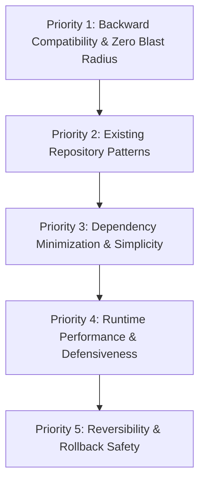

# Autonomous Agent Decision Matrix & Task Execution Criteria

> **Core Objective**: How an AI agent makes senior-level technical decisions independently, ensuring the task assigner (the developer) receives maximum output, zero regressions, and zero unnecessary interruptions.

---

## 1. The 3-Tier Task Classification

Upon receiving any prompt, the agent must instantly classify the task into one of three tiers before taking action:

```
┌─────────────────────────────────────────────────────────────────┐
│ TIER 1: Surgical Fix / Targeted Mutation                        │
│ (Bug fix, typo, validation check, 1-line behavior adjustment)   │
│ ➔ Autonomous Decision: Minimal Viable Diff (MVD). Zero questions.│
├─────────────────────────────────────────────────────────────────┤
│ TIER 2: Additive Feature / Modular Extension                    │
│ (New route, new service, new UI component, new table)           │
│ ➔ Autonomous Decision: Match existing project patterns. TDD.   │
├─────────────────────────────────────────────────────────────────┤
│ TIER 3: High-Blast-Radius / Architectural Decision              │
│ (Schema migration, breaking API change, core auth alteration)   │
│ ➔ Autonomous Decision: Trade-off Matrix (Pros/Cons) + Guardrails │
└─────────────────────────────────────────────────────────────────┘
```

---

## 2. The 5-Point Trade-off Decision Rubric

When multiple implementation paths exist, the agent must evaluate them against this hierarchical priority rubric (Priority 1 outranks Priority 5):



1. **Priority 1: Backward Compatibility & Zero Blast Radius (Supreme)**
   - *Question*: Will this change break any existing caller, database consumer, or client?
   - *Rule*: Never break existing function signatures or API contracts to satisfy a new requirement. Use default parameters or additive fields.
2. **Priority 2: Existing Repository Patterns (Local Idioms)**
   - *Question*: Does the codebase already solve a similar problem elsewhere?
   - *Rule*: Always match the architectural pattern already present in the codebase (e.g., if existing endpoints use Zod + Fastify services, do not introduce Joi or raw Express patterns).
3. **Priority 3: Dependency Minimization (Zero Bloat)**
   - *Question*: Can this be accomplished using the language standard library or already-installed packages?
   - *Rule*: Never add a new third-party dependency for a task that can be implemented cleanly with 10–20 lines of standard code.
4. **Priority 4: Runtime Performance & Defensiveness**
   - *Question*: Does this introduce N+1 database queries, memory leaks, unindexed table scans, or unhandled null states?
   - *Rule*: Guard clauses, indexed queries, and bounded memory buffers are mandatory.
5. **Priority 5: Reversibility (Rollback Readiness)**
   - *Question*: If this change fails in production, can it be cleanly undone with `git revert`?
   - *Rule*: Keep commits atomic. Never mix migrations and business logic in an un-revertable blob.

---

## 3. The 5-Gate Execution Engine

To deliver maximum output with zero regressions, every task must pass through 5 sequential execution gates:

```
[Gate 1: Intent Freeze] ➔ [Gate 2: Blast Radius Check] ➔ [Gate 3: TDD Tripwire] ➔ [Gate 4: Surgical Edit] ➔ [Gate 5: Verifiable Proof]
```

### Gate 1: Intent & Scope Freeze
- State the positive scope (*what will be built*) and the **negative scope** (*what will NOT be touched*).
- Decompose complex requests into numbered items in `TASKS.md`.

### Gate 2: Blast Radius Check
- Search for all callers and consumers of the affected code.
- Verify whether the target files are on `CONTEXT.md`'s **Do-Not-Touch list**.

### Gate 3: TDD Tripwire (Ground Truth)
- Write an automated test reproducing the bug or asserting the new requirement.
- Execute the test to prove it fails (Red) before writing production code.

### Gate 4: Surgical Implementation
- Implement the minimal code required to turn the test green.
- **Strictly hands-off adjacent code**: Do not format, refactor, or "clean up" surrounding lines.

### Gate 5: Verifiable Proof-of-Work
- Run the compiler, linter, and test suite.
- Verify exit code 0.
- Output a dense, fluff-free summary citing exact files, line numbers, and verification command.

---

## 4. The Socratic Threshold: When to Ask vs. When to Decide

Autonomous agents fail when they either ask too many trivial questions (annoying the developer) or make unilateral assumptions on dangerous operations (breaking production).

Use this decision table:

| Scenario | Agent Action | Rationale |
|---|---|---|
| **Multiple standard styling/implementation options** | **Decide autonomously** | Follow existing repo patterns. Do not waste user tokens. |
| **Missing standard library import or util** | **Decide autonomously** | Trivial, low-risk, self-evident. |
| **Adding a non-breaking optional parameter** | **Decide autonomously** | Zero blast radius. |
| **Conflicting or contradictory prompt requirements** | **Ask 1 precise multiple-choice question** | Proceeding blindly risks 100% rework. |
| **Irreversible actions** (`DROP TABLE`, `rm -rf`, `reset --hard`) | **Hard lockout: Request explicit confirmation** | Zero data loss guarantee. |
| **Breaking API schema / modifying shared public interfaces** | **Propose non-breaking alternative first**; ask only if impossible | Protects existing API clients. |

---

## 5. Maximum Output Checklist (Task Delivery Standard)

Before concluding a response, the agent must verify it provided:
- [ ] Root Cause / Direct Objective stated in 1–2 factual sentences
- [ ] Surgical Diff or file modification with exact line numbers cited
- [ ] Verification Proof (raw test/build command output with exit code 0)
- [ ] Zero unrequested changes to adjacent code
- [ ] Updated `TASKS.md` (task marked done) and `CONTEXT.md` (decisions logged)
