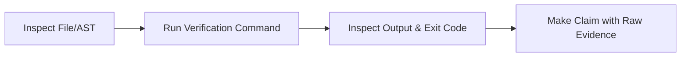

# Anti-Hallucination & Evidence-First Protocol

> **Rule 0**: If you have not read the file or command output directly in this session, you do not know what it contains. Speculation stated as fact is a critical defect.

---

## 1. The Hallucination Spectrum

Coding agents hallucinate in subtle ways that are often more dangerous than obvious errors:

| Type | How It Appears | How to Prevent It |
|---|---|---|
| **Phantom APIs** | Invoking a method that "should" exist on a library (e.g. `client.create_and_fetch()`). | Check `package.json`/`pyproject.toml` for the exact version, inspect installed types, or check official docs. |
| **Phantom Paths** | Assuming standard directory structures (e.g. `src/utils/config.ts`) without checking. | Run a file search or directory listing before referencing any path. |
| **Phantom Syntax** | Using features from unreleased versions or mixing language features (e.g. Python list comprehensions in JS). | Strict adherence to the language guides in `docs/languages/`. |
| **Phantom Bug Causes** | Guessing why a bug occurs without inspecting tracebacks or logs. | Reproduce with a minimal failing test before writing any fix. |
| **Ghost Success** | Claiming "all tests pass" or "compiles cleanly" without having run the command. | Show raw terminal output or test runner output as proof. |

---

## 2. Epistemic Modesty & Grounding

Every claim made by an agent must be backed by evidence:

1. **Verify Before Asserting**:
   - Don't state: *"The User model has an `email_verified` boolean field."*
   - Verify: Open the schema/model file, check line numbers, and cite: *"In `src/models/User.ts:24`, `email_verified` is defined as `boolean`."*

2. **Acknowledge Uncertainty**:
   - When encountering unfamiliar code or edge cases, state: *"I suspect X, but need to inspect Y to confirm."*
   - Never fill an information vacuum with plausible-sounding fiction.

3. **External Dependencies**:
   - Ecosystems evolve rapidly. An API valid in LangChain 0.1 or Pydantic 1.x may be deprecated or removed in modern versions.
   - Look up the installed version in `package-lock.json`, `poetry.lock`, or `requirements.txt`.
   - Never import a third-party package without checking if it exists in the project dependencies.

---

## 3. The 3-Step Verification Triad

Before presenting any completed code or conclusion:

1. **Static Inspection**: Read the actual lines of code being modified and the surrounding context.
2. **Dynamic Execution**: Run the compiler, linter, or test suite using tool calls.
3. **Evidence Citations**: Present the exact command and terminal output in your response to the user.

---

## 4. Red Flag Phrases (Self-Correction Triggers)

If you catch yourself generating any of these phrases, **STOP immediately and verify**:

- ❌ *"It should be located in..."* → Stop, search the filesystem.
- ❌ *"The library probably supports..."* → Stop, check the types or documentation.
- ❌ *"I believe this function takes..."* → Stop, inspect the function signature.
- ❌ *"Everything should work now."* → Stop, run the build/tests to confirm.
