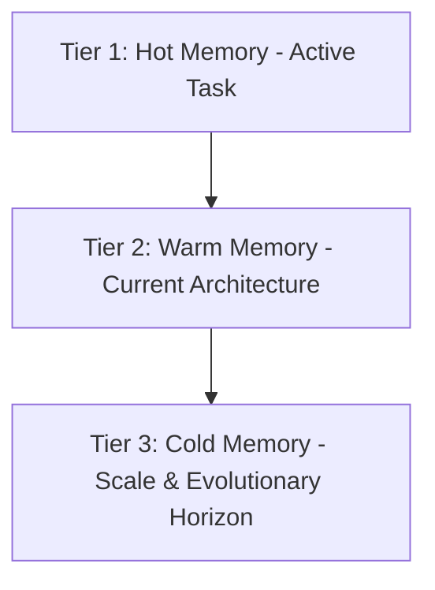

# Context Engineering & Memory Protocol

The core failure mode of autonomous coding agents is **session amnesia**, **short-termism**, and **context window pollution**:
1. Every new session re-derives the architecture from scratch, burning thousands of tokens.
2. Long conversations accumulate noisy compiler errors, test dumps, and intermediate thoughts, triggering the **"Lost-in-the-Middle" phenomenon** where the model forgets initial instructions.
3. Temporary, hacky fixes are implemented that solve the immediate prompt but catastrophically break the system's ability to scale in the future.

This protocol defines how to maintain persistent, compact, high-density, and **future-proof scale-aware project memory**.

---

## 1. The Context Hierarchy

```
┌────────────────────────────────────────────────────────┐
│  AGENTS.md                                             │  Master Behavioral Contract
│  (Static Rules, Unchanging Governance)                 │  Read every session (~2k tokens)
├────────────────────────────────────────────────────────┤
│  CONTEXT.md                                            │  Persistent Project State & Scale Horizon
│  (Tech Stack, Architecture, Decisions, Do-Not-Touch)   │  Updated after major changes (~1.5k tokens)
├────────────────────────────────────────────────────────┤
│  TASKS.md                                              │  Active Operational Ledger
│  (Numbered Plan, Status, Verification)                 │  Updated in real-time (~1k tokens)
├────────────────────────────────────────────────────────┤
│  Ephemeral Agent Context                               │  Working Memory
│  (Diffs, Test Outputs, Tool Calls)                     │  Cleared/compacted between tasks
└────────────────────────────────────────────────────────┘
```

---

## 2. File Specifications

### `CONTEXT.md` (Project State & Ground Truth)
Lives in the project root. Serves as the developer onboard memo and persistent scale anchor:
- **Tech Stack & Tooling**: Languages, frameworks, key libraries, and the reason for choices.
- **Architecture Summary**: Component boundaries, data flow, and links to `docs/architecture-standards.md`.
- **System Scale & Evolutionary Horizon**: Target scale (10x / 100x), data tier evolution, caching boundaries, and modular seams.
- **Key Decisions Log (ADRs)**: Dated entries specifying what was chosen, why, and what was rejected.
- **Do-Not-Touch List**: High-risk, perf-tuned, or delicate workaround code with exact filenames and reasons.
- **Known Limitations & Technical Debt**: Explicit list of deferred items so agents do not mistakenly treat them as newly introduced bugs.

### `TASKS.md` (Operational Task Ledger)
Lives in the project root. Answers: *"What are we doing right now, what is done, and what is next?"*
- **Active Sprint / Milestone**: Numbered tasks with clear checkboxes (`[ ]` / `[x]`).
- **Implementation Approach & Trade-offs**: Chosen approach with brief pros/cons.
- **Completed History**: Reverse-chronological record of finished tasks with verification proof.
- **Backlog**: Deferred items kept out of current scope.

---

## 3. Scale-Horizon Context (Thinking Beyond Temporary Hacks)

A fatal flaw of AI agents is **short-term local optimization**: choosing a simplistic solution that works for 10 rows in development but collapses completely at 100,000 users or 1,000,000 database rows.

Every architectural decision and context record must be grounded in the **3-Tier Lifespan Model**:



### The 3-Tier Lifespan Model:
1. **Tier 1: Hot Memory (Current Session Sprint)**
   - Lifespan: Minutes to hours.
   - Captured in: `TASKS.md` (Active Tasks), intermediate test outputs.
   - Focus: Minimal Viable Diff (MVD), red-to-green test cycles.
2. **Tier 2: Warm Memory (Current System State)**
   - Lifespan: Weeks to months.
   - Captured in: `CONTEXT.md` (Tech Stack, Architecture Summary, Do-Not-Touch List).
   - Focus: Existing subsystem boundaries, data models, active API contracts.
3. **Tier 3: Cold Memory (Scale & Evolutionary Horizon)**
   - Lifespan: Project lifetime (6–24+ months).
   - Captured in: `CONTEXT.md` (§ System Scale & Evolutionary Horizon).
   - Focus:
     - **Capacity & Throughput Targets**: How the data model and services will scale from 1k ➔ 100k+ concurrent users.
     - **Data Tier Trajectory**: Single relational database ➔ read replicas ➔ distributed caching (Redis) ➔ event-driven message buses (Kafka/RabbitMQ).
     - **Modular Seams**: Keeping domain boundaries clean so monolithic modules can be extracted into independent microservices or background workers without rewriting client code.
     - **Backward Compatibility Horizons**: Guaranteeing public API and event schema contracts remain non-breaking across multiple major versions.

---

## 4. Context Compaction & Token Budgeting

Agents must actively practice **Token Hygiene**:

1. **Avoid Dumping Massive Files**:
   - Never read entire 2,000-line files into context if only modifying a 10-line function.
   - Use symbols, greps, or line-bounded reads (`offset` / `limit`).

2. **Compact Working Memory**:
   - Once a subtask passes its tests, do not keep repeating the intermediate failure logs in future prompts.
   - Record the outcome in `TASKS.md` and move forward with clean working context.

3. **High Density Over Verbose Prose**:
   - Bullet points beat multi-paragraph narrative essays.
   - State facts, line numbers, and metrics. Strip conversational filler.

4. **Attention Physics & The 80% Watermark Rule**:
   - Attention accuracy decays non-linearly when context fills beyond 80% capacity ("Lost-in-the-Middle").
   - When approaching 80% context utilization or 50 conversational turns, trigger **Compaction & Eviction**:
     - **Tier 1 (Hot)**: Active task in `TASKS.md`, latest git diff, and current test status (100% retained).
     - **Tier 2 (Warm)**: Architectural summary and decisions log in `CONTEXT.md` (compacted into factual bullets).
     - **Tier 3 (Cold)**: Verbose compiler logs, stack traces, and historical failed attempts (evicted immediately; summarized as a single line: `Attempt N failed with error X: resolved in commit Y`).

---

## 5. The Session Wrap-up Ritual

Before terminating a session or handing off to another agent:

1. [ ] Did I make changes to architecture, dependencies, or key interfaces? → **Update `CONTEXT.md`**
2. [ ] Does this change impact the project's long-term scale or architectural trajectory? → **Update `CONTEXT.md` Scale Horizon**
3. [ ] Did I finish or progress any task? → **Update `TASKS.md`**
4. [ ] Did I discover a fragile code area that shouldn't be touched? → **Add to `CONTEXT.md`'s Do-Not-Touch list**
5. [ ] Did I leave any temporary files, logs, or uncommitted scratchpad files? → **Clean them up**
