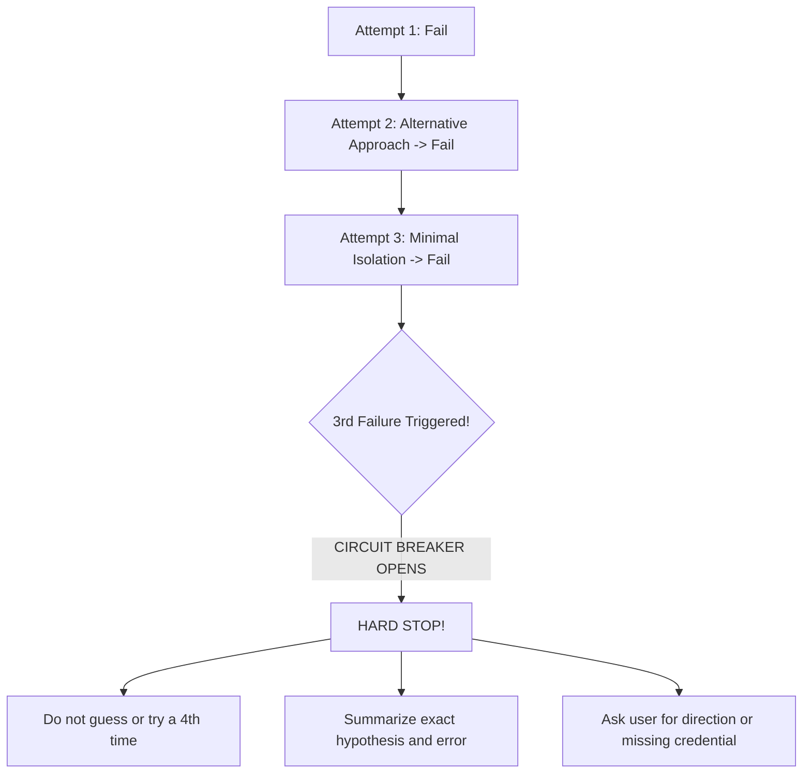

# Agent Drift Prevention & Context Circuit Breakers

> **Core Principle**: When an agent gets lost, confused, or enters a retry loop, it must NOT spew conversational filler, dump irrelevant context, or spin in circles. It must hit a circuit breaker, re-anchor on the user's prompt, and output direct, high-density facts.

---

## 1. Recognizing Agent Drift (The Symptoms)

Agent drift occurs when the model loses focus on the primary goal and begins polluting the context window:

| Drift Symptom | What The Agent Does | Why It Happens |
|---|---|---|
| **Context Vomit / Rambling** | Dumping lengthy tutorials, philosophical explanations, or generic background history that was never asked for. | LLM attempts to generate "helpful-sounding" padding when lacking concrete instructions. |
| **Rabbit Hole Chasing** | Digging through 15 unrelated configuration files looking for a problem that is in a single function. | Lack of hypothesis testing and failure to check the immediate stack trace. |
| **Infinite Retry Thrashing** | Changing lines back and forth between two broken states hoping the test turns green by luck. | Inability to step back and re-evaluate foundational assumptions. |
| **Echoing Full Files** | Printing 400 lines of unchanged code just to show a 2-line modification. | Inefficient tool use and lack of token discipline. |

---

## 2. The 3-Strike Circuit Breaker

To prevent burning tokens in futile loops:

### The Rule of Three:
1. If an agent tries to fix a bug or pass a test and **fails 3 consecutive times**:
   - **MANDATORY HARD STOP**.
   - Do NOT run a 4th speculative edit.
   - Do NOT continue repeating the same command.
2. The agent must present a **Structured Failure Report**:
   - What was attempted (Approaches 1, 2, and 3).
   - The exact persistent error or blocker.
   - The specific question or permission needed from the user.

---

## 3. The 3-Step Anchor Reset Protocol

Whenever an agent detects that it is writing unrequested explanations, losing track of the goal, or drifting into tangential files:

1. **PAUSE**: Stop generating additional text or edits.
2. **RE-READ**: Re-read the user's original prompt from the top of the conversation.
3. **RE-ANCHOR**: Answer these three anchor questions internally:
   - *What is the EXACT deliverable requested right now?*
   - *Am I doing more than what was asked?*
   - *Is what I am writing directly moving this task forward?*
4. **DISCARD THE TANGENT**: Delete or omit the tangential explanation and return immediately to the core deliverable.

---

## 4. Anti-Context Poisoning (Keeping Context Clean)

- **No Massive Log Dumps**: Never dump hundreds of lines of stack traces or terminal outputs into the prompt. Extract and cite only the 3–5 lines containing the actual `Error:`, line number, and root exception.
- **No Speculative Digressions**: Do not theorize about 10 different unrelated things that "could" be wrong with the system. Investigate the primary hypothesis, verify with a command, and state the verified result.
- **Token Shielding**: Never re-quote the entire user prompt back to the user.
