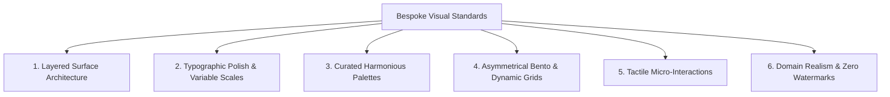

# Modern Frontend Aesthetics & Anti-AI-Slop Design Protocol

> **Core Objective**: Eradicate generic, cookie-cutter "AI bootstrap" templates. Enforce bespoke, production-grade visual excellence, sophisticated typography, layered surface architecture, and authentic domain realism.

---

## 1. The Anatomy of "AI Slop" (What is Strictly Forbidden)

When left to default generation, AI models produce websites that immediately scream *"cheap, unpolished AI generation"*:

```
❌ The Hallmarks of AI Slop:
1. Cliché Centered Hero: Generic pill badge ("✨ AI-Powered v2.0") over a centered heading with a generic purple-to-blue linear gradient.
2. The "3-Box" Card Grid: Exactly 3 identical rectangular boxes with 1px gray borders, generic Lucide icons, and zero visual hierarchy.
3. Sterile Gray Color Palettes: Harsh #ffffff backgrounds with default #000000 text and #e5e7eb borders, lacking atmospheric depth.
4. Robotic Placeholder Copy: Cliché phrases like "Streamline your workflow with cutting-edge solutions" or "Lorem Ipsum dolor sit amet".
5. Abrupt, Lifeless Interactions: Harsh instant hover color changes without easing curves or tactile feedback.
6. Flat Surface Structure: Zero sense of elevation, depth, or optical layering.
```

---

## 2. The 6 Pillars of High-End Digital Aesthetics



### Pillar 1: Layered Surface Architecture (Depth Over Flatness)
- **Hierarchy of Surfaces**: Build visual depth using distinct surface layers rather than flat 1px outlines:
  - *Base Surface*: Deep background (`hsl(240 10% 3.9%)` or soft off-white `hsl(0 0% 98%)`).
  - *Sub-Surface*: Recessed areas, secondary sidebars, input backgrounds (`hsl(240 5% 6%)`).
  - *Card Surface*: Raised elements with subtle border luminescence (`border: 1px solid hsl(var(--border) / 0.08)`).
  - *Overlay Surface*: Modals, popovers, and dropdowns with backdrop blur (`backdrop-blur-md bg-background/80`).
- **Subtle Atmospheric Lighting**: Use low-opacity radial ambient gradients (`radial-gradient(ellipse at top, hsl(var(--primary) / 0.15), transparent 70%)`) to create atmosphere without visual noise.

### Pillar 2: Typographic Mastery & Fluid Scale
- **Curated Font Stacks**: Replace browser defaults with modern, characterful variable typefaces:
  - Sans-Serif: *Plus Jakarta Sans*, *Geist*, *Inter*, *Outfit*, *Instrument Sans*.
  - Serif / Editorial: *Newsreader*, *Playfair Display*, *Instrument Serif*.
  - Monospace: *JetBrains Mono*, *Geist Mono*, *Fira Code*.
- **Fluid Type Scale**: Use CSS `clamp()` so headers scale organically across viewport widths:
  ```css
  font-size: clamp(2.25rem, 5vw + 1rem, 4.5rem);
  line-height: 1.05;
  letter-spacing: -0.03em; /* Tight optical tracking on display headers */
  ```
- **Contrast & Legibility**: Body copy must maintain relaxed line heights (`line-height: 1.6`) with high contrast ratios meeting WCAG 2.1 AA (4.5:1 minimum).

### Pillar 3: Curated, Non-Default Color Palettes
- **Never Use Raw Primary Colors**: Avoid raw `#ff0000`, `#0000ff`, or saturated pure primary neon gradients.
- **Tonal HSL Palette**: Structure colors around a semantic design token system:
  - Neutral Base (Zinc, Slate, or Stone across 9 tones).
  - Primary Accent (Intentional, desaturated or calibrated for dark/light mode balance).
  - Subtle Border Ratios: Borders should define boundaries with whisper-thin opacities (`hsl(var(--foreground) / 0.08)`), never harsh solid black/gray lines.

### Pillar 4: Asymmetrical Bento & Dynamic Layouts
- **Break the 3-Box Uniformity**: Replace uniform 3-card rows with asymmetrical Bento-grid compositions:
  - Hero card spans 2 columns with rich preview visuals.
  - Secondary metric cards span 1 column with live data chips.
  - Large interactive showcase spans full width or dynamic height.
- **Content-Driven Proportions**: Let the nature of the data determine card sizing rather than forcing identical box dimensions.

### Pillar 5: Tactile Micro-Interactions & Fluid Motion
- **Refined Easing Curves**: Avoid linear or default browser transitions. Use physics-informed easing:
  ```css
  transition: all 0.25s cubic-bezier(0.16, 1, 0.3, 1);
  ```
- **State Feedback**:
  - Buttons: Subtle active scale (`active:scale-[0.98]`), delicate border highlight on hover.
  - Cards: Soft translateY lift (`hover:-translate-y-1`), ambient glow shadow on hover.
  - Skeletons: Shimmering wave animations instead of abrupt spinning circles.

### Pillar 6: Domain Realism & Zero Watermarks
- **Authentic Copy & Data**:
  - Zero "Lorem Ipsum".
  - Zero "Card Title 1", "Placeholder text".
  - Write realistic domain copy reflecting the actual product (real medical terminology in healthcare, real financial instruments in fintech, realistic metric gauges).
- **No Watermarks or AI Disclaimers**: Do not generate text with AI apologies, robotic meta-commentary, or synthetic disclaimers. Deliver the interface as if authored by a top-tier design studio.

---

## 3. The Modern CSS & Component Checklist

Before declaring any frontend or HTML deliverable complete, verify:

- [ ] Typography uses modern font stack with explicit tracking and line-heights.
- [ ] Visual hierarchy is clear: primary focus is instantly recognizable within 2 seconds.
- [ ] No generic 3-box identical card templates; layouts use fluid grids and responsive breakpoints.
- [ ] Micro-interactions have smooth easing (`cubic-bezier`), not harsh instant swaps.
- [ ] Colors use curated HSL semantic tokens; zero raw primary primaries.
- [ ] Copy is 100% authentic to the domain with zero placeholder strings.
- [ ] Tested across mobile, tablet, and widescreen viewports.
