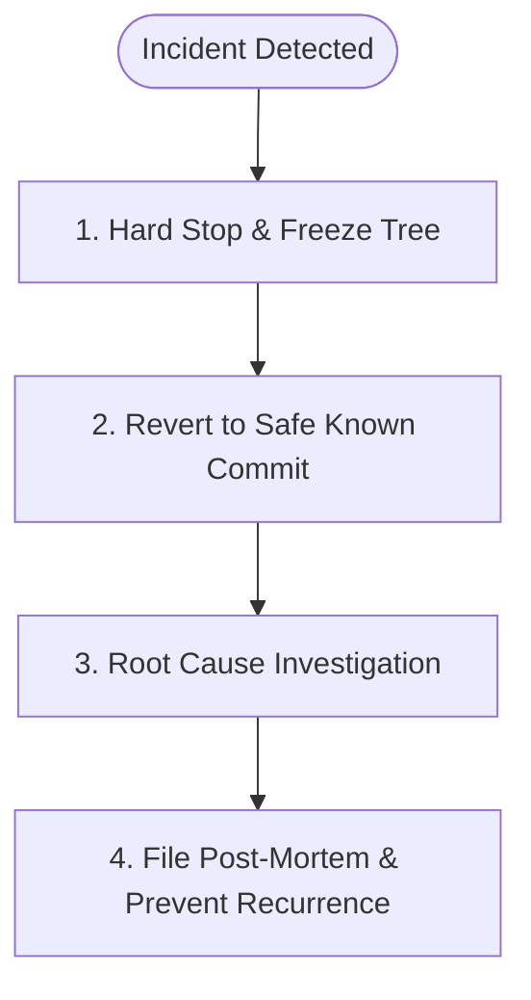

# Agent Incident Response & Circuit Breaker Post-Mortem Runbook

> **Core Objective**: Protocol for handling catastrophic agent failures, infinite loop trips (3-Strike Circuit Breaker), production regressions, or destructive command breaches.

---

## 1. When Does This Runbook Trigger?

This runbook is activated immediately when any of the following occur:
1. **3-Strike Circuit Breaker Tripped**: An agent fails 3 consecutive times to compile, pass a test, or resolve a bug (see [`docs/drift-prevention-and-circuit-breakers.md`](./drift-prevention-and-circuit-breakers.md)).
2. **Blast Radius Regression**: A change silently breaks existing tests or downstream production services.
3. **Data Loss / Safety Violation**: An unauthorized destructive command was executed, uncommitted developer work was modified, or credentials/PII were leaked.
4. **Architectural Drift**: An agent hallucinated an unapproved dependency or refactored files on the Do-Not-Touch list.

---

## 2. The 4-Step Incident Containment Workflow



### Step 1: Hard Stop & Working Tree Freeze
- **Immediate Halt**: Cease all autonomous edits. Do not attempt a "quick 4th try" to fix the issue.
- **Check Working Tree**:
  ```bash
  git status
  git diff
  ```
- Identify exact files modified since the last known green commit.

### Step 2: Safe Rollback
- If uncommitted changes caused degradation:
  ```bash
  # Discard changes ONLY after confirming uncommitted developer work is protected
  git checkout -- <regressed-files>
  ```
- If bad commits were already made:
  ```bash
  git revert <bad-commit-sha>
  ```
- Run the baseline test suite to prove working tree is restored to Green (exit code 0).

### Step 3: Five-Whys Root Cause Analysis
Investigate WHY the failure happened:
1. Did the prompt lack explicit negative scope?
2. Did the agent violate the Minimal Viable Diff (MVD) rule by touching adjacent code?
3. Did the agent skip writing a reproducing test before coding (Gate 3)?
4. Did the agent guess an API signature without inspecting actual files?

### Step 4: Author Post-Mortem & Permanent Tripwire
- Create a post-mortem document using the standardized template: [`templates/INCIDENT_POSTMORTEM.md`](../templates/INCIDENT_POSTMORTEM.md).
- Write an automated regression test (tripwire) that prevents this specific failure mode from recurring.
- Append lessons learned to `CONTEXT.md` Key Decisions Log and update the Do-Not-Touch list if applicable.
