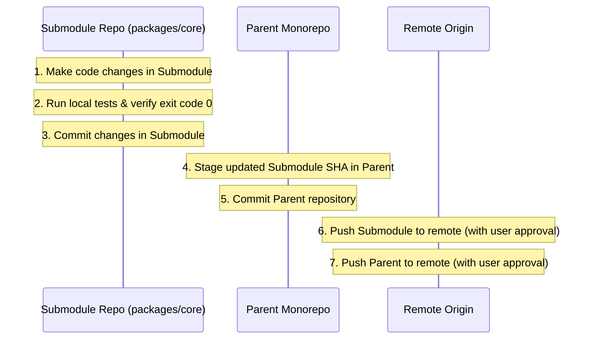

# Monorepo, Multi-Package & Polyrepo Governance Protocol

> **Core Principle**: In multi-package repositories, nested workspaces, or multi-repo submodule topologies, an agent must never treat the project as a flat monolith. Changes must be strictly quarantined to the targeted package boundary, and shared dependencies must be updated with zero ripple regressions.

---

## 1. Supported Repository Topologies

An agent must inspect the root to auto-detect the repository topology:

| Topology | Detection Fingerprints | Core Invariants |
|---|---|---|
| **JS / TS Monorepo** | `pnpm-workspace.yaml`, `lerna.json`, `turbo.json`, `nx.json`, root `package.json` with `"workspaces"` | Scoped package dependencies (`workspace:*`), isolated `package.json` per package. |
| **Rust Cargo Workspace** | Root `Cargo.toml` with `[workspace]` block | Members compiled via `cargo build -p <pkg>`, shared `Cargo.lock`. |
| **Go Multi-Module** | `go.work`, `go.work.sum` | Modules linked via `go work use`, avoid uncommitted local replace directives. |
| **Python Monorepo** | Root `pyproject.toml` with `tool.uv.workspace` or `poetry` multi-project | Shared lockfile, isolated virtual environments or workspaces. |
| **Java / JVM Multi-Module** | Root `pom.xml` with `<modules>`, `settings.gradle` with `include` | Hierarchical build lifecycles, parent POM dependency management. |
| **Git Submodules & Subtrees** | `.gitmodules`, git pointer entries in index | Submodule commits must precede parent pointer updates. |
| **Polyrepo Swarm** | Sibling directories orchestrated by meta-CLI tools | Independent git branches, semantic version lockstep. |

---

## 2. Hierarchical Context Memory (The Dual-Tier Anchor)

In a monorepo containing dozens or hundreds of packages, a single root `CONTEXT.md` becomes bloated and triggers context window degradation. 

The constitution enforces **Hierarchical Context Partitioning**:

```
monorepo-root/
├── AGENTS.md                  # Supreme Behavioral Contract (Global)
├── CONTEXT.md                 # System-Wide Architecture, Shared Invariants, Target Scale Horizon
├── TASKS.md                   # Global Cross-Cutting Operational Ledger
├── packages/
│   ├── auth-service/
│   │   ├── CONTEXT.md         # Package-Specific Stack, Local DB, Do-Not-Touch List
│   │   ├── TASKS.md           # Local Feature Sprint Ledger
│   │   └── src/
│   └── billing-ui/
│       ├── CONTEXT.md         # Framework, Design Tokens, Client API Endpoints
│       ├── TASKS.md           # UI Sprint Ledger
│       └── src/
```

### Context Resolution Algorithm:
1. **Always Read Root Contracts First**: The agent reads root `AGENTS.md` and root `CONTEXT.md` to understand system-wide invariants.
2. **Read Scoped Context**: Before modifying files in `packages/auth-service/`, the agent inspects `packages/auth-service/CONTEXT.md` if present.
3. **Inherit & Override**: Local package context overrides root context ONLY for package-specific dependencies and build commands. Universal behavioral laws (MVD, Git Push Lockout, Circuit Breakers) cannot be overridden locally.

---

## 3. Package Boundary Containment (Anti-Leakage Law)

When tasked with modifying a package (e.g. `packages/auth-service`):

1. **Strict Blast Radius Quarantine**:
   - The agent is **strictly forbidden** from touching files in sibling packages (`packages/billing-ui`, `packages/analytics`) unless the prompt explicitly orders a cross-package refactor.
2. **No Ad-Hoc Cross-Imports**:
   - Packages must communicate strictly via published package interfaces (e.g., `@myorg/auth`), never via relative upward directory traversal (`../../packages/auth/src/internal`).
3. **Workspace Dependency Protocol**:
   - When consuming sibling packages in pnpm/yarn/npm, use explicit workspace protocols (`"workspace:^"`). Never hardcode relative file paths in `dependencies`.
4. **Selective Build & Test Execution**:
   - Run tests only for the modified package and its direct consumers:
     - Turborepo: `turbo run test --filter=...[HEAD~1]`
     - Nx: `nx affected --target=test`
     - pnpm: `pnpm --filter <pkg> test`
     - Cargo: `cargo test -p <pkg>`
     - Go: `go test ./packages/<pkg>/...`

---

## 4. Git Submodule & Subtree Discipline

When operating in repositories utilizing Git submodules:

### The Safe Submodule Commit Order:


**Critical Submodule Rule**: Never update a submodule commit pointer in the parent repository to an unpushed or detached submodule commit. Doing so causes `fatal: reference is not a tree` for other developers cloning the repo.

---

## 5. Shared Package Versioning & Lockfile Protection

1. **Shared Lockfile Integrity**:
   - In monorepos with a root lockfile (`pnpm-lock.yaml`, `Cargo.lock`), adding a dependency to one package modifies the shared lockfile.
   - The agent must inspect `git diff <lockfile>` to ensure other workspace packages were not accidentally updated or downgraded.
2. **Semantic Version Lockstep**:
   - If modifying an internal library consumed by 5 other packages, verify whether the change introduces a breaking API change.
   - If breaking: bump package major/minor version, update consumers, or preserve backward compatibility using deprecation wrappers.
