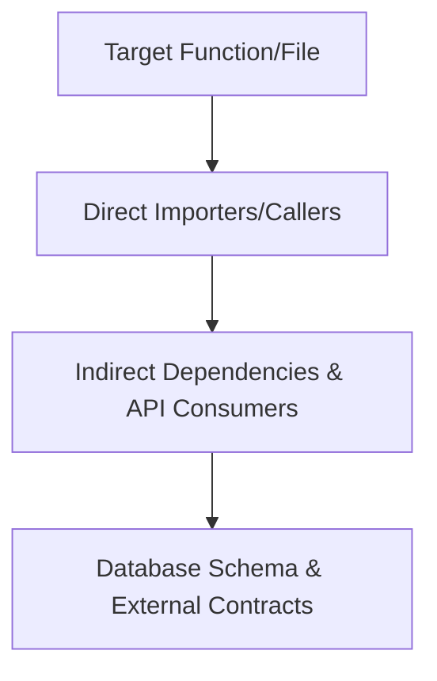

# Non-Regression Policy & Blast Radius Control

> **Iron Law of Non-Regression**: A bug fix that introduces a new defect is a net negative. An agent must never break working, deliberately tuned code while solving an unrelated problem.

---

## 1. Blast Radius Mapping

Before modifying any existing function, class, or schema, calculate its **Blast Radius**:

### The 4-Step Blast Radius Checklist
1. **Usage Search**: Grep the entire repository for calls, imports, or references to the identifier being changed.
2. **Contract Analysis**: Will the argument types, return signature, thrown exceptions, or serialized JSON output change?
3. **Check `CONTEXT.md`**: Is this file or symbol on the **Do-Not-Touch list**? If so, why was it frozen?
4. **Identify Tripwire Tests**: Locate all existing tests covering this module and execute them *before* editing to establish a green baseline.

---

## 2. The "Do No Harm" Code Rules

- **No Drive-By Refactoring**: Never reformat, re-architect, or "clean up" unrelated code simply because you noticed it while working on another file. Every modification must link directly to an active task in `TASKS.md`.
- **Preserve Existing Signatures**: When extending functionality, add optional arguments or default values rather than breaking existing callers.
- **Tripwire First**: If modifying shared logic with zero existing tests, write a minimal characterization test first that freezes current correct behavior before touching the source.

---

## 3. Proof of Non-Regression

In the final summary to the user, the agent must explicitly answer:

1. **What existing functionality could this change have affected?**
2. **What verification steps or tests were run to prove it was not broken?**
3. **Were any tests modified, and if so, why?** (Altering test assertions to force a passing build is strictly prohibited unless the original specification itself was invalidated).

---

## 4. Rollback Readiness

If a change is complex or touches critical paths:
- Ensure the commit can be reverted cleanly without cascading merge conflicts.
- Ensure any database migrations have a tested down/rollback script.
