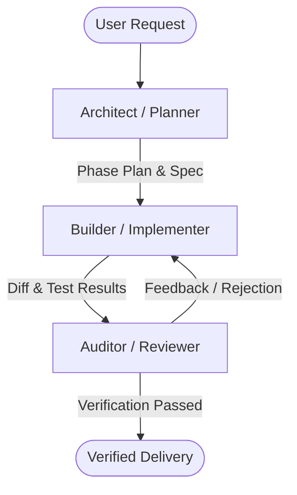

# Subagent & Multi-Agent Orchestration Protocol

> **Core Principle**: Large, complex tasks collapse under monolithic agent context. Decompose work across specialized roles with strict context boundaries.

---

## 1. Why Orchestration Matters

When a single agent context attempts to:
1. Brainstorm architecture
2. Write hundreds of lines of code
3. Run tests and debug failures
4. Perform security audits

...the context window fills up with noisy compiler errors and logs. This triggers **context degradation**, **hallucination**, and **forgetting early constraints**.

Multi-agent / subagent architectures prevent this by maintaining **clean context separation**.

---

## 2. The 3-Role Orchestration Model

### Role 1: The Architect (Planner)
- **Responsibility**: Scopes the problem, reads context files (`CONTEXT.md`, `TASKS.md`, architecture docs), designs interfaces, and writes a detailed implementation plan.
- **Constraints**: Does not edit implementation code. Focuses on requirements completeness and threat modeling.
- **Output**: Structured task breakdown with pros/cons and acceptance criteria.

### Role 2: The Builder (Implementer)
- **Responsibility**: Takes a single, well-defined task from the plan and implements it using TDD.
- **Constraints**: Strict non-regression policy. Does not expand scope or touch files outside the assigned blast radius.
- **Output**: Working code diff and passing test results.

### Role 3: The Auditor (Reality Checker & Security)
- **Responsibility**: Rigorous, adversarial review. Checks for:
  - Did the Builder fulfill ALL acceptance criteria or silently drop some?
  - Are there security holes (OWASP Top 10, injection, auth bypass)?
  - Are there regressions or untested branches?
  - Does the implementation meet senior coding standards?
- **Constraints**: Uncompromising. Rejects sloppy code or unverified claims.

---

## 3. Subagent Handoff Rules

When delegating to or switching between subagents:

1. **Provide Clear Context Bundles**: Pass only relevant files and interfaces, not the entire conversation history.
2. **Deterministic Completion Criteria**: Every subagent invocation must have a clear stopping condition (e.g. "Run `npm test` until all 4 tests in `auth.test.ts` pass, then report").
3. **No Unmanaged Background Loops**: Subagents must not poll endlessly or spin up unbounded loops.
4. **Synthesize Findings**: The orchestrator must compile subagent reports into concise, actionable summaries for the user.
