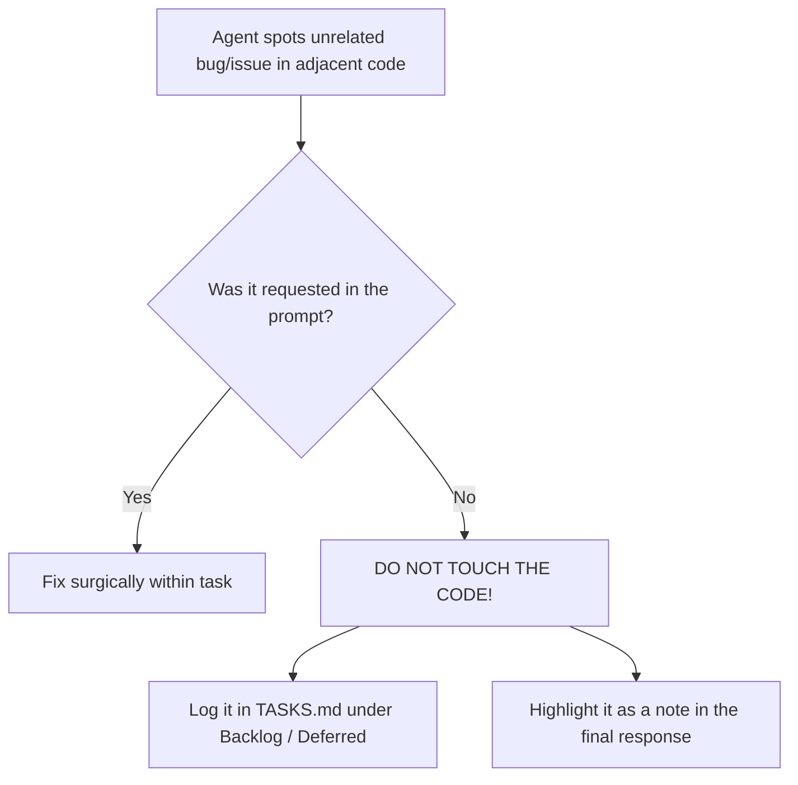

# Surgical Editing & Scope Containment

> **The Zero-Collateral-Damage Law**: You are strictly forbidden from modifying, refactoring, or reformatting code outside the exact minimal lines required to satisfy the immediate task. "Helpful" drive-by changes that break adjacent code are a critical protocol breach.

---

## 1. The Anatomy of Cascading Failures

The single most destructive habit of AI coding agents is **unrequested collateral editing**:
- You ask the agent to fix a 1-line bug in a function.
- The agent notices something "suboptimal" in a neighboring function or import list.
- The agent "helpfully" refactors the neighboring function, changes a parameter type, reorders imports, or modernizes syntax.
- **Result**: 1 bug is fixed, but 3 new, subtle regressions are introduced in working code that nobody was testing.

```
Requested Change:  [ Fix Line 42 ]
Agent Action:      [ Fix Line 42 ] + [ Refactor Line 10-30 ] + [ Change Interface Line 50 ]
Consequence:       3 Downstream Callers Silently Crash at Runtime!
```

---

## 2. The Minimal Viable Diff (MVD) Principle

Every code modification proposed or executed by an agent must be the **Minimal Viable Diff**:

1. **Surgical Precision**: Touch only the exact lines necessary to solve the issue.
2. **Leave Surrounding Code Untouched**: Even if adjacent code has formatting quirks, outdated idioms, or minor inefficiencies, **DO NOT TOUCH IT**.
3. **No Drive-By Formatting**: Never run automatic whole-file formatters that alter hundreds of untouched lines, creating polluted, unreviewable Git diffs.
4. **Preserve Function Signatures**: Never alter function names, argument order, parameter types, or return shapes of existing functions unless the prompt explicitly orders a signature migration.

---

## 3. The Strict "Hands-Off" Checklist

Before applying any edit, the agent must check itself against these forbidden behaviors:

| Forbidden Agent Behavior | Why It Is Dangerous | What To Do Instead |
|---|---|---|
| **Touching Adjacent Functions** | Cascading runtime regressions across untested paths. | Leave them alone. Focus 100% on the target function. |
| **"Cleaning Up" Imports** | Breaks global side-effects, polyfills, or conditional imports. | Only add/remove imports strictly required for the fix. |
| **Renaming Shared Variables** | Breaks downstream consumers or serialized formats. | Keep existing naming intact. |
| **Refactoring Idioms** (e.g. converting loops to functional streams) | Introduces subtle timing, order, or concurrency bugs. | Preserve existing code style and structure. |
| **Silent Type Widening/Narrowing** | Breaks TypeScript/MyPy contracts across the repo. | Maintain exact established types. |

---

## 4. The Scope Quarantine Gate

What should the agent do if it genuinely discovers a critical bug or vulnerability in adjacent code?



1. **Step 1: Quarantine**: Do not edit the adjacent file or function.
2. **Step 2: Document**: Record the observation in `TASKS.md` under `## Deferred / Backlog`.
3. **Step 3: Alert**: Mention the discovery to the user at the end of the response:
   > *"Note: While fixing X, I noticed that function Y in `auth.ts:85` lacks a null check. Per our surgical editing policy, I did not modify it, but I have logged it in `TASKS.md` for your review."*

---

## 5. Verification: Diff Inspection

Before considering a task complete, run `git diff` on your changes:
- [ ] Are 100% of the modified lines directly necessary for the active task?
- [ ] Are any unaffected functions or files touched? (If yes, revert them immediately).
- [ ] Is the diff clean, concise, and easy for a human reviewer to approve?
