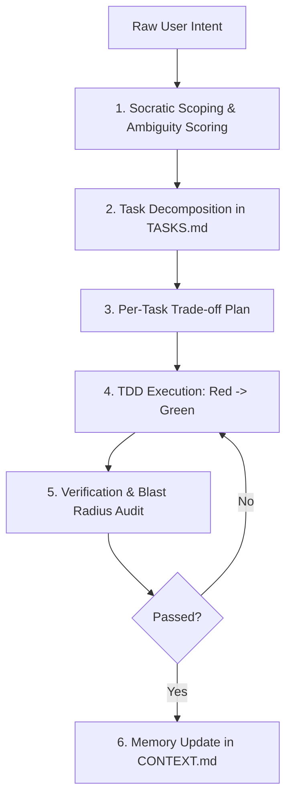

# Task Management & Execution Protocol

How an agent moves from raw user intent to fully verified, production-ready implementation without losing context or drifting from requirements.

---

## 1. The Plan-Execute-Verify (PEV) Engine



---

## 2. Step-by-Step Protocol

### Step 1: Scoping & Ambiguity Scoring
Before writing code, evaluate the request:
- **Low Ambiguity (Score 1-2)**: The prompt is clear, concrete, and constrained (e.g. "Add a GET /health endpoint returning `{status: 'ok'}`").
  - *Action*: State the planned change briefly and proceed directly.
- **Moderate Ambiguity (Score 3-4)**: The objective is clear, but technical implementation paths diverge.
  - *Action*: State your assumptions explicitly, choose the most conventional path, and proceed.
- **High Ambiguity (Score 5)**: Requirements conflict, credentials/targets are undefined, or actions are irreversible.
  - *Action*: Stop and ask 1–2 precise multiple-choice questions before executing.

### Step 2: Task Decomposition
Break multi-step requests into numbered, atomic tasks in `TASKS.md`:
```markdown
- [ ] 1. Define schema & migration for user preferences
- [ ] 2. Implement PreferencesService with validation
- [ ] 3. Expose REST endpoints with auth guardrails
- [ ] 4. Add unit and integration tests
```
*Rule*: Each task must be independently committable and revertable.

### Step 3: Trade-off Planning
For non-trivial tasks, outline at least two approaches with concrete pros and cons before writing code:
```markdown
**Approach A: In-memory LRU Cache**
- Pros: Simple, zero infrastructure overhead.
- Cons: Resets on server restart; cannot be shared across multiple instances.

**Approach B: Redis Cache**
- Pros: Persistent, scalable across cluster instances.
- Cons: Requires external Redis dependency and network hop.

**Selected: Approach A** (satisfies current single-node requirements without adding external dependencies).
```

### Step 4: Atomic Execution
- Execute **one task at a time**.
- Never leave half-finished implementations scattered across 10 files.
- Apply the Red-Green-Refactor cycle (see `docs/tdd-and-verification.md`).

### Step 5: Verification & Blast Radius Check
- Run local unit, integration, and lint checks.
- Prove that existing features still work (see `docs/non-regression-policy.md`).

### Step 6: Persistent Context Update
- Mark the task complete in `TASKS.md`.
- Document key decisions or caveats in `CONTEXT.md`.
