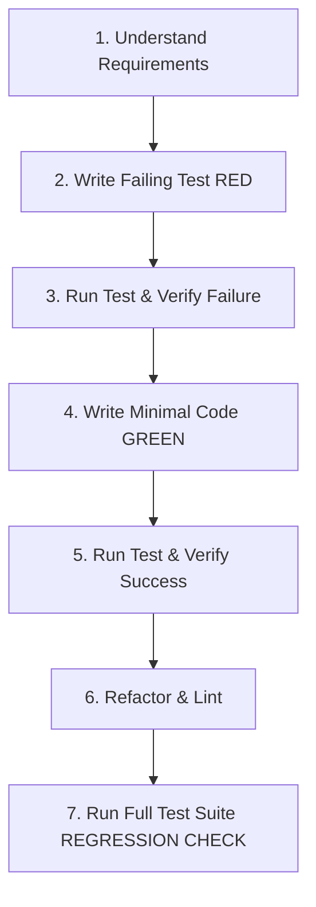

# Agent Test-Driven Development (TDD) & Verification Protocol

> **Core Principle**: Code written without tests is an unverified hypothesis. Agents that write tests *before* implementation code produce 80% fewer regressions and hallucinations.

---

## 1. Why TDD is Essential for Agents

LLMs are probabilistic pattern matchers. When an agent writes code without an automated test:
1. It relies on its own internal belief that the code works.
2. It cannot detect subtle syntax, runtime, or logical off-by-one errors.
3. It cannot prove that adjacent functionality remains unbroken.

When an agent writes a failing test first (Red), makes it pass (Green), and refactors (Refactor), it operates against an **objective runtime feedback loop**.

---

## 2. The Agent Red-Green-Refactor Cycle

### Phase 1: RED (Failing Test First)
- Write an automated unit or integration test that specifies the expected behavior.
- **Run the test suite** to prove the test actually fails with the expected error (e.g., `AssertionError`, `404 Not Found`, `MethodNotImplemented`).
- *Anti-Pattern*: Writing a test that accidentally passes before the feature is implemented (vacuous test).

### Phase 2: GREEN (Minimal Implementation)
- Write the simplest possible implementation that satisfies the test.
- Do not add unrequested bells and whistles.
- **Run the test suite** to confirm the test now passes.

### Phase 3: REFACTOR (Senior Polish)
- Clean up duplication, improve variable naming, ensure types are strict.
- Verify readability and adherence to `docs/coding-standards.md`.
- Run tests again to ensure refactoring didn't introduce flaws.

### Phase 4: FULL REGRESSION CHECK
- Run the full project test suite (or affected module tests).
- Ensure existing features still pass with 0 regressions.

---

## 3. Bug Reproduction Protocol

When tasked with fixing a bug:

1. **Do not touch the implementation code yet.**
2. Write a minimal test that triggers the bug under the reported conditions.
3. Execute the test and capture the failure traceback.
4. Apply the fix in the source code.
5. Rerun the test to confirm it now passes.
6. The reproduction test becomes a permanent regression test in the repository.

---

## 4. Test Quality Standards

- **Behavioral Names**: Name tests for behavior, not method names.
  - Good: `test_returns_401_when_jwt_is_expired()`
  - Bad: `test_auth_1()`
- **No Mock Abuse**: Mock external networks, file I/O, and clock time, but do not mock the internal logic of the module under test.
- **Cover Edge Cases**:
  - Empty lists, null / nil / undefined inputs
  - Boundary limits (0, -1, max int, empty strings)
  - Network timeouts and error responses
