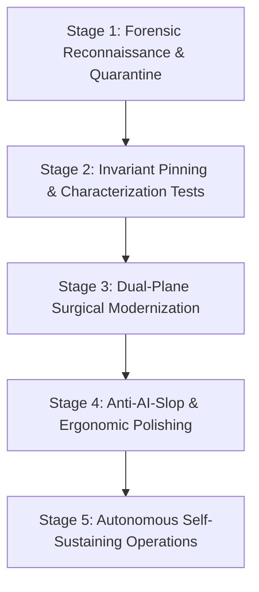

# Transforming Ordinary & Legacy Codebases into High-Level Systems

> **The Level-Up Charter**: How any messy, undocumented, or legacy repository is systematically elevated into an elite, resilient, high-velocity engineering system using the Agent Constitution.

---

## 1. The Ordinary Project Problem (Why AI Breaks Messy Repos)

When an AI coding agent is dropped into an ordinary or legacy codebase:
- **No Invariant Boundaries**: Everything is tightly coupled; 1 change triggers cascading breakages across unmonitored files.
- **Tribal Knowledge Gaps**: Crucial architectural quirks, fragile workarounds, and environment secrets live only in developers' heads.
- **Diff Proliferation**: The AI attempts to rewrite entire legacy files rather than making surgical edits, creating massive 2,000-line un-reviewable pull requests.
- **AI Slop Inflation**: Generic boilerplate, unnecessary dependencies, and placeholder code (`# TODO`) accumulate rapidly.

**The Solution**: Agent Constitution provides a structured 5-Stage Transformation Pipeline that turns an ordinary codebase into a self-governing, senior-grade project.

---

## 2. The 5-Stage Elevation Pipeline



### Stage 1: Forensic Reconnaissance & Quarantine
1. **Initialize the Constitution**:
   ```bash
   npx agent-constitution init
   npx agent-constitution hooks
   ```
2. **Populate the Do-Not-Touch List in `CONTEXT.md`**:
   Identify fragile legacy modules (e.g. legacy auth tokens, complex regex parsers, third-party integration wrappers). Add them explicitly to the Do-Not-Touch list.
   *Invariant*: Any agent attempting to modify these files without explicit instructions is blocked immediately.
3. **Run the Diagnostic Doctor**:
   ```bash
   npx agent-constitution doctor
   ```
   Fix any missing environment variables, stale adapters, or hook bypasses before writing code.

---

### Stage 2: Invariant Pinning (Characterization Tests)
Never refactor legacy code without establishing tripwires:
1. **Write Characterization Tests**: Before modifying messy legacy code, write automated tests that assert current behavior (even quirks or bugs).
2. **Commit Test Tripwires Atomically**: Ensure the test suite passes on the untouched baseline (`exit code 0`).
3. **Lock Down the Baseline**:
   ```bash
   npx agent-constitution benchmark
   ```

---

### Stage 3: Dual-Plane Surgical Modernization
Apply the **Dual-Plane Cognitive Architecture** (`docs/limitless-first-principles-agency.md`):
1. **Micro Execution Plane**:
   - Implement user-requested fixes with **Minimal Viable Diff (MVD)**.
   - Touch only the target lines. Never perform unprompted cosmetic cleanup on neighboring legacy functions.
   - Run `npx agent-constitution diff-guard` to verify zero accidental file pollution.
2. **Macro Visionary Plane**:
   - As the AI navigates the legacy codebase, it analyzes structural bottlenecks and technical debt from first principles.
   - It records **10x Modernization Proposals** in `TASKS.md ## Backlog` or as formal proposals in `templates/ADR.md`.

---

### Stage 4: Anti-AI-Slop & Ergonomic Polishing
Elevate the project's quality to world-class standards:
1. **Frontend Architecture**: If the project contains a web UI, audit against `docs/frontend-design-and-aesthetics.md`. Replace generic boxes, raw bootstrap defaults, and purple gradients with bespoke typography, curated color tokens, and layered depth.
2. **Type Soundness**: Replace legacy `any` or untyped structures with strict typing interfaces.
3. **Zero Placeholders**: Eradicate `# TODO`, `// FIXME`, and dummy mock data using `npx agent-constitution diff-guard`.

---

### Stage 5: Autonomous Self-Sustaining Operations
Protect the elevated codebase permanently:
1. **Deploy the GitHub Action Gate**:
   Copy `templates/github-action-ci.yml` to `.github/workflows/agent-constitution-gate.yml`.
   Every future PR created by AI or junior developers is validated automatically in CI.
2. **Persistent Memory Discipline**:
   Every agent session updates `CONTEXT.md` and `TASKS.md` before terminating, ensuring new chats pick up context seamlessly without amnesia.

---

## 3. Transformation Scorecard (Before vs. After)

| Metric | Ordinary / Legacy Project | After Agent Constitution Elevation |
|---|---|---|
| **Regression Rate** | High (1 fix breaks 2+ features) | **Zero (MVD + Characterization tests)** |
| **Git Safety** | Dirty commits, direct pushes to main | **Enforced feature branches & pre-push lockout** |
| **Context Retention** | Session amnesia; re-explaining every chat | **Durable memory (`CONTEXT.md` / `TASKS.md`)** |
| **Code Quality** | Placeholder tokens, AI slop, untyped code | **Bespoke aesthetics, zero placeholders, strict types** |
| **Visionary Horizon** | Short-term hacks and quick patches | **10x-100x first-principles architectural roadmap** |
